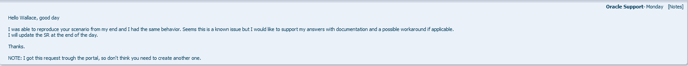
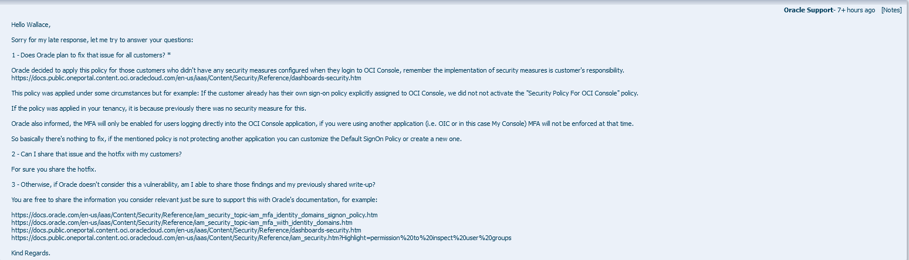

# OCI Waf Bypass - Disclaimer

## First Report

On November 28th, I discovered a security flaw that allowed me to access my account using the "MyConsole" endpoint without any secondary authentication method being prompted. I reported it on the same day to the email *security@oracle.com*. Initially, I chose not to report it with my logged-in account but rather as an independent researcher.

Deeming it a significant issue, I believed a response would be provided promptly. However, after five days without a response, I decided to open a support ticket. This marked the second time I was reporting this vulnerability.

## Second Report

On Sunday, December 3rd, I opened the ticket to be able to monitor the progress of this case. The case was recorded under the number 3-35057398681.

However, on the very next day, I received news that initially left me quite concerned. Oracle communicated that this behavior is already known and instructed me on how to resolve the issue. This resolution method will be presented in the [hotfix section](HOTFIX.md).

After applying the corrections, I inquired about whether the issue would be addressed at its root. Additionally, in the event that Oracle did not consider this point a vulnerability, I asked if I could disclose further information. Below, we can observe the response sent by Oracle regarding these queries.

So, here am I :smile:
