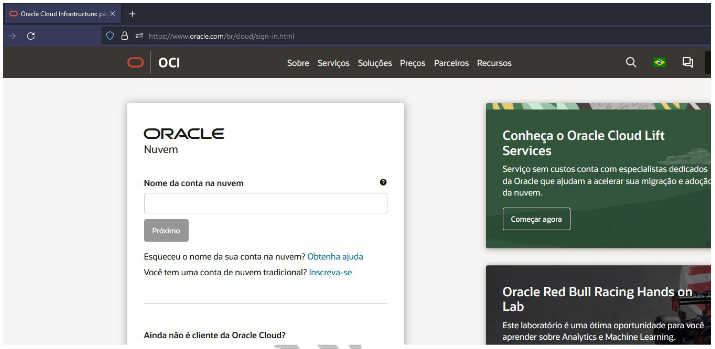
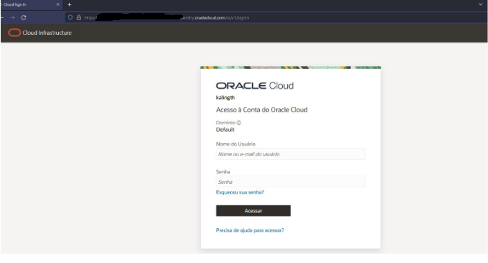
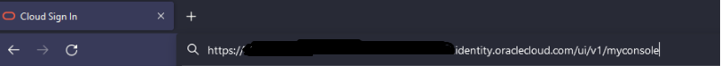
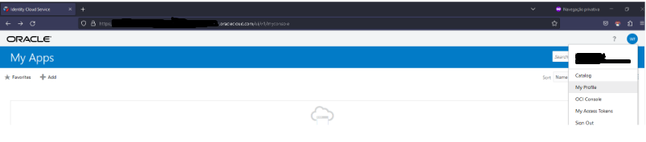
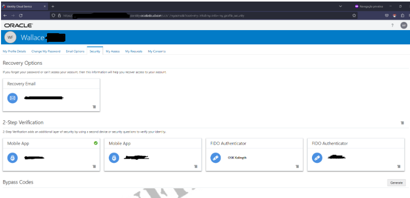

# OCI Waf Bypass - Write-up

* Access the Oracle Cloud [Login Screen](https://www.oracle.com/br/cloud/sign-in.html)

* After inserting my account name, I was redirected to the following screen.

* I manipulated the URL by changing the URN from /ui/v1/signin to /ui/v1/myconsole.

* After submission, I was redirected to the same login screen. However, this time, the form redirected me to the legacy console, bypassing the MFA. Voilà.
> Here, proceed only with your login using your credentials.

* At this point, I can change the password, update the primary email, add more MFA methods, and perform additional actions on my account using the "My Profile" settings.

* As you can see below, I added my self-made security key “OSK Kalingth” after bypassing my account's MFA. Now, if I were a cracker, I could access that account using the stolen password and my self-made FIDO2 security key.

